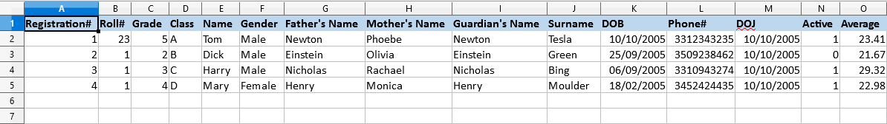

**Spreadsheet**
-------------------------------------------------------------------------------
Spreadsheet library is intended to provide annotations for parsing spreadsheets
and workbooks to java objects. This will handle the boilerplate code required
while directly using libraries like Apache POI. 

**Sample excel:**



**POJO with annotations to parse a Workbook**
```java
@Workbook
public class TestWorkbook {

    @Sheet(name = "info")
    private StudentInformationSheet testSheet2;

    private String name;
}
```
`@Sheet(name = <String>)` specifies that the given object will store a sheet with given name

**POJO with annotations to parse a Sheet**
```java
public class StudentInformationSheet {

    @Row
    private StudentInfoSheetHeader studentInfoSheetHeader;

    @Rows(start = 2)
    private List<StudentInformationRow> StudentInformationRows;
}
```
`@Row(start = <Integer>)` specifies the row to start the parsing from.

`@Row()` starts from the first position.

**POJO with annotations to Parse a Row**
```java
public class StudentInformationRow {
    @Cell(position = 1)
    private Integer regNumber;
    @Cell(position = 2)
    private Integer rollNumber;
    @Cell(position = 3)
    private Integer grade;
    @Cell(position = 4)
    private String className;
    @Cell(position = 5)
    private String name;
    @Cell(position = 6)
    private String gender;
    @Cell(position = 7)
    private String fathersName;
    @Cell(position = 8)
    private String mothersName;
    @Cell(position = 9)
    private String guardiansName;
    @Cell(position = 10)
    private String surname;
    @Cell(position = 11)
    private Date dob;
    @Cell(position = 12)
    private String phoneNumber;
    @Cell(position = 13)
    private Date doj;
    @Cell(position = 14)
    private Boolean isActive;
    @Cell(position = 15)
    private Double average;  
    @Cell(position = 15, deserializer = AverageCheckCellDeserializer.class)
    private Boolean anAverage;
}
```
`@Cell(position = <Integer>)` specifies the index of a cell in the row
 
`@Cell(position = 15, deserializer = AverageCheckCellDeserializer.class)` A Custom Deserializer 

**Parse a workbook**
```java
    WorkBook workbook = new XSSFWorkbook(filePath);
    WorkbookParser<TestWorkbook> workbookParser = new WorkbookParser<>();
    workbookParser.parse(workbook, TestWorkbook.class);
```

**Parse a sheet**
```java
    Sheet sheet = workbook.getSheet("info")
    SheetParser<StudentInformationSheet> sheetParser = new SheetParser<>();
    sheetParser.parse(sheet, StudentInformationSheet.class);
```

**Parse a Row**
```java
    Row row = sheet.getRow(0)
    RowParser<StudentInfoSheetHeader> rowParser = new RowParser<>();
    StudentInfoSheetHeader actual = rowParser.parse(headerRow, StudentInfoSheetHeader.class);
```
